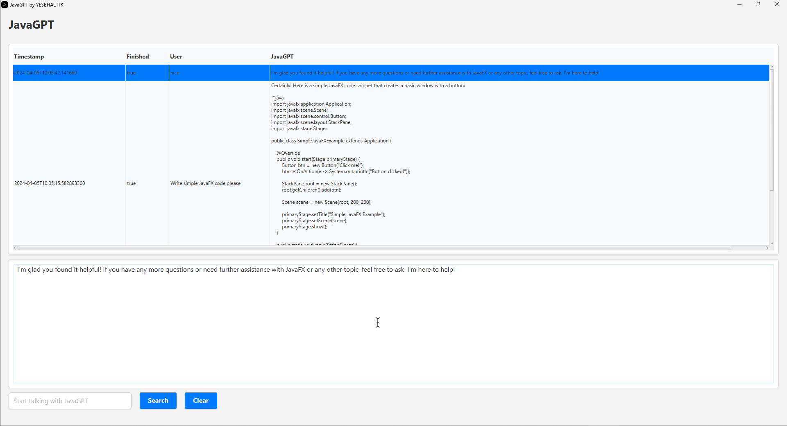

# JavaGPT Chat Application

This project is a JavaFX-based chat application that integrates with OpenAI's GPT models to provide intelligent responses to user queries. It uses a MySQL database to store chat history.

## Features

- Chat interface for user interaction.
- Integration with OpenAI's GPT models for generating responses.
- Database support for storing chat history.
- Customizable UI with CSS.

## Screenshot of Application



## Prerequisites

- Java 17 or higher.
- Maven for dependency management and project build.
- MySQL database for storing chat history.

## Setup Instructions

### Clone the Repository

Start by cloning the repository to your local machine:

```bash
git clone https://github.com/yesbhautik/JavaGPT.git
cd javafx-chat-application
```

### Configure Database Connection

1. Navigate to `src/main/resources/`.
2. Rename `example.db.properties` to `db.properties`.
3. Open `db.properties` and update the following properties with your MySQL database details:

```properties
db.url=jdbc:mysql://HOST:PORT/DATABASENAME?zeroDateTimeBehavior=CONVERT_TO_NULL
db.user=USERNAME
db.password=PASSWORD
```

### Set Up the Database

Run the following SQL script to create the necessary table in your MySQL database:

```sql
CREATE TABLE chat_messages (
id INT AUTO_INCREMENT PRIMARY KEY,
timestamp VARCHAR(255) NOT NULL,
question TEXT NOT NULL,
answer TEXT NOT NULL,
finished BOOLEAN NOT NULL
);
```

### Configure OpenAI API Key

1. Navigate to `src/main/resources/`.
2. Rename `example.api.properties` to `api.properties`.
3. Open `api.properties` and update the following properties with your OpenAI API details:

```properties
openai.api.key=YOUR_OPENAI_API
```

### Build and Run the Application

Use Maven to build and run the application:

```bash
mvn javafx:run
```

## Usage

After launching the application, you can start interacting with JavaGPT by typing questions into the input field and pressing the "Search" button or the Enter key. Your chat history will be saved and can be viewed upon restarting the application.

## Contributing

Contributions are welcome. Please open an issue first to discuss what you would like to change or add.

## License

This project is open-source and available under the [MIT](https://github.com/yesbhautik/JavaGPT/blob/main/LICENSE) License.
